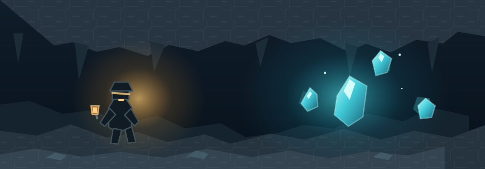

# 矿石工艺 · Ore Craft

> 每一条矿脉，都藏着尚未被发现的可能。

## 深处的回声

传说，最早的矿工曾在地底听见石头的低语。他们发现，矿石蕴藏的价值并不会随着开采而消失；只要懂得记录和转化，它就能以新的形态回到手中。于是，采矿不再只是寻找稀有之物，也成了探索万物之间联系的旅程。

**矿石工艺**是一款围绕采矿、资源转化与地下探索展开的 Minecraft 模组。它希望让每一次深入洞穴、每一份带回地面的收获，都成为下一次创造的起点。

适用于 **Minecraft 1.21.1 · NeoForge**。
