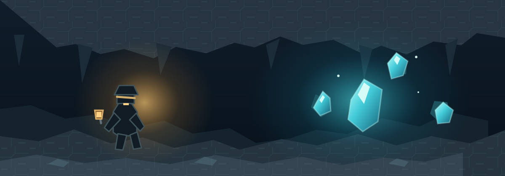

# 矿石工艺 · Ore Craft

> 每一条矿脉，都藏着尚未被发现的可能。

## 深处的回声

传说，最早的矿工曾在地底听见石头的低语。他们发现，矿石蕴藏的价值并不会随着开采而消失；只要懂得记录和转化，它就能以新的形态回到手中。于是，采矿不再只是寻找稀有之物，也成了探索万物之间联系的旅程。

**矿石工艺**是一款围绕采矿、资源转化与地下探索展开的 Minecraft 模组。它希望让每一次深入洞穴、每一份带回地面的收获，都成为下一次创造的起点。

适用于 **Minecraft 1.21.1 · NeoForge**。

## 管理命令

在聊天栏输入 `/orecraft clearlearned [目标]` 可清空玩家的全部矿质学习记录，需要开启作弊或具有等级 2 及以上的 OP 权限。此操作保留 ME 余额和所有物品，并立即刷新在线玩家的学习目录。

| 命令 | 清空范围 |
| --- | --- |
| `/orecraft clearlearned` | 自己 |
| `/orecraft clearlearned @a` | 所有在线玩家 |
| `/orecraft clearlearned 玩家名` | 指定在线玩家 |
| `/orecraft clearlearned UUID` | 指定 UUID 的在线玩家 |

服务器控制台也可以执行此命令，需要明确指定目标。清空后，转化桌、学习宝典和矿质转化器使用同一份重置后的学习记录。
